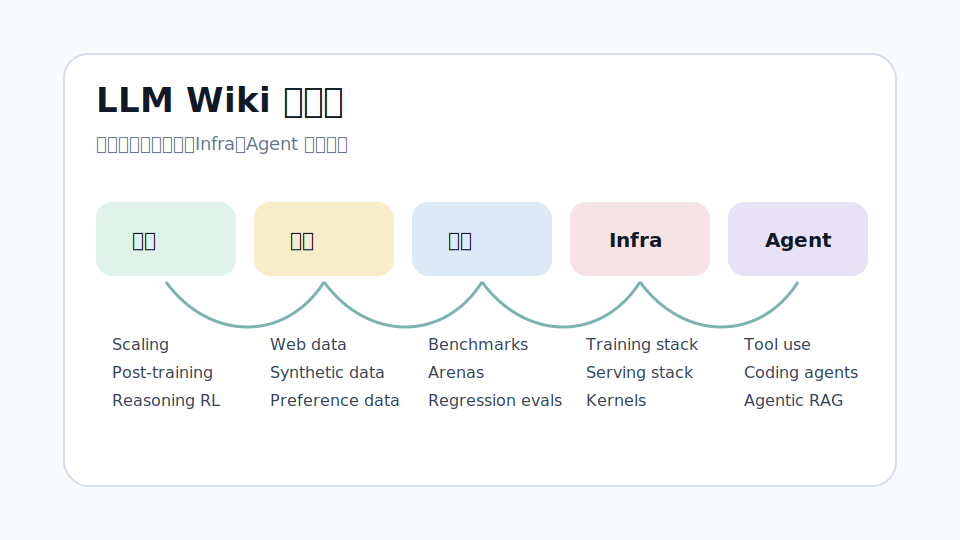

# Awesome-LLM Wiki

近五年 LLM 技术地图。核心目标：把技术报告、可复现资料、找工方向和最新进展放在一个可搜索的 GitHub Pages 站点里。

更新时间：2026-06-28。内容优先级：技术报告、model card、system card、官方 release、可复现论文。

  
  

    <h2 style="border:0;margin-top:0;padding-top:0">怎么读</h2>
    <ul>
      <li>想快速补全领域：先看时间线，再看五大方向。</li>
      <li>想找工作：看找工地图，按岗位补项目。</li>
      <li>想追最新模型：看技术报告索引。</li>
      <li>想做研究：从训练、数据、评测、Infra、Agent 的交叉处找题。</li>
    </ul>
  

## 五大方向

  

    <h3>训练</h3>
    
Scaling law、架构、post-training、reasoning RL、多模态训练。

    <a href="./training/">进入训练</a>
  

  

    <h3>数据</h3>
    
预训练数据、合成数据、偏好数据、数据过滤、可复现语料。

    <a href="./data/">进入数据</a>
  

  

    <h3>评测</h3>
    
动态基准、Arena、Agent 评测、代码评测、回归测试。

    <a href="./evaluation/">进入评测</a>
  

  

    <h3>Infra</h3>
    
训练系统、推理服务、内核、长上下文、集群与部署。

    <a href="./infra/">进入 Infra</a>
  

  

    <h3>Agent</h3>
    
工具调用、代码 agent、浏览器/电脑控制、Agentic RAG。

    <a href="./agents/">进入 Agent</a>
  

## 最新核查

2026-06-28 核查到的最新关键项：

  <a href="https://deploymentsafety.openai.com/gpt-5-6-preview">GPT-5.6 Preview</a>
  <a href="https://www.anthropic.com/news/claude-fable-5-mythos-5">Claude Fable 5 / Mythos 5</a>
  <a href="https://deepmind.google/blog/gemini-3-5-frontier-intelligence-with-action/">Gemini 3.5</a>
  <a href="https://ai.google.dev/gemma/docs/core/model_card_4">Gemma 4</a>
  <a href="https://docs.x.ai/developers/models/grok-4.3">Grok 4.3</a>
  <a href="https://arxiv.org/html/2606.19348v1">DeepSeek-V4 Preview</a>
  <a href="https://github.com/QwenLM/Qwen3.6">Qwen3.6</a>
  <a href="https://z.ai/blog/glm-5.2">GLM-5.2</a>
  <a href="https://arxiv.org/html/2605.26494v1">MiniMax-M2</a>
  <a href="https://research.nvidia.com/labs/nemotron/files/NVIDIA-Nemotron-3-Ultra-Technical-Report.pdf">Nemotron 3 Ultra</a>

## 设计参考

- [OI Wiki](https://oi-wiki.org/)：知识点分层、可搜索、适合长期维护。
- [CS DIY](https://csdiy.wiki/)：学习路径清晰，适合自学和找工。
- [Hugging Face LLM Course](https://huggingface.co/learn/llm-course/chapter1/1)：实践导向。
- [LLMSys-PaperList](https://github.com/AmberLJC/LLMSys-PaperList)：系统方向参考。

## 比已有项目补强的地方

| 已有项目 | 优点 | 本站补强 |
|---|---|---|
| 旧版 Awesome-LLM README | 链接多，覆盖广 | README 保持短索引，Wiki 承接长内容和技术路线 |
| Hugging Face LLM Course | 实践强 | 增加近两年模型报告、评测、Infra、Agent |
| LLMSys-PaperList | 系统论文细 | 只作为 Infra 参考，主线覆盖全栈 LLM |
| 各类 roadmap | 适合入门 | 增加论文到岗位技能的映射 |

## 快速入口

  <a href="./milestones">五年时间线</a>
  <a href="./sources">技术报告索引</a>
  <a href="./roadmap">找工地图</a>
  <a href="./glossary">术语表</a>
  <a href="./evaluation/">评测地图</a>

